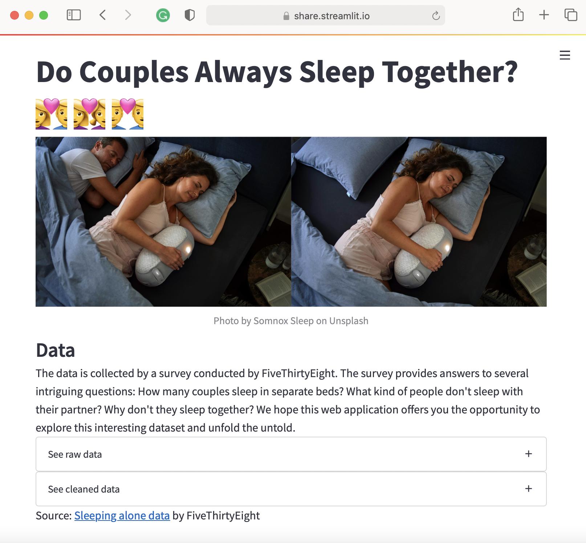

# Do Couples Always Sleep Together?

The project is inspired by a longlasting question that many kids may have in their childhood: Why my parents don't sleep together?

FiveThirtyEight published an article [*Dear Mona, How Many Couples Sleep in Separate Beds?*](https://fivethirtyeight.com/features/dear-mona-how-many-couples-sleep-in-separate-beds/) with a survey to explore people's sleeping arrangements. The survey was conducted via a online platform. It provides answers to several intriguing questions: How many couples sleep in separate beds? What kind of people don't sleep with their partner? Why don't they sleep together? We visualize the dataset through an interactive web application which offers the audience the opportunity to explore this interesting dataset and unfold the untold.

## Project Goals

TODO: **A clear description of the goals of your project.** Describe the question that you are enabling a user to answer. The question should be compelling and the solution should be focused on helping users achieve their goals. 

To understand the sleeping arrangements of different couples. What types of demographic features will lead to a higher proportion of sleeping separately with their partner. Demographic features included age, gender, household income, occupation, relationship status, relationship length.

## Design

TODO: **A rationale for your design decisions.** How did you choose your particular visual encodings and interaction techniques? What alternatives did you consider and how did you arrive at your ultimate choices?

## Development

TODO: **An overview of your development process.** Describe how the work was split among the team members. Include a commentary on the development process, including answers to the following questions: Roughly how much time did you spend developing your application (in people-hours)? What aspects took the most time?

## Success Story

TODO:  **A success story of your project.** Describe an insight or discovery you gain with your application that relates to the goals of your project.
